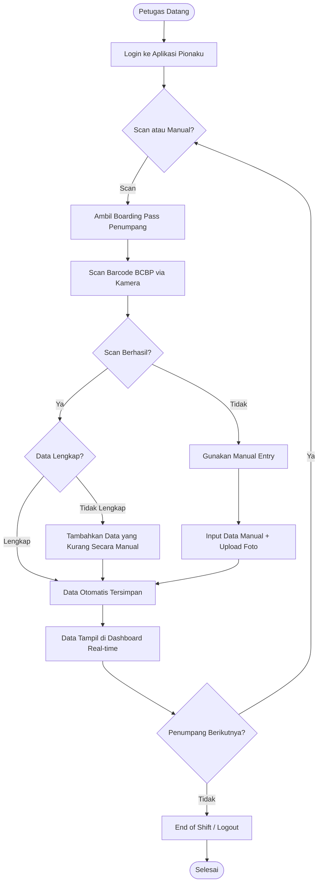
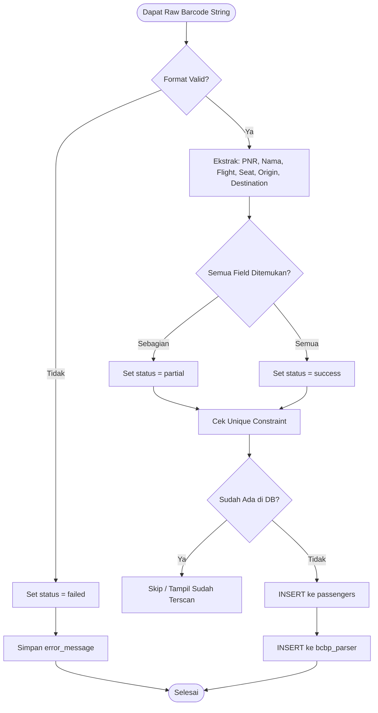
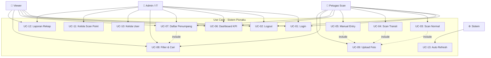
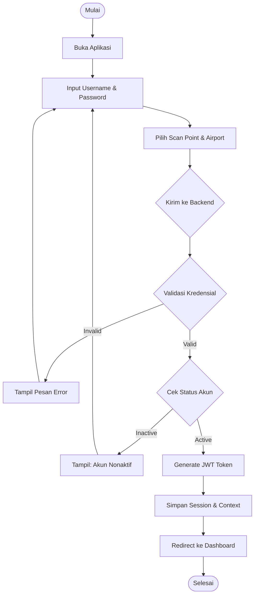
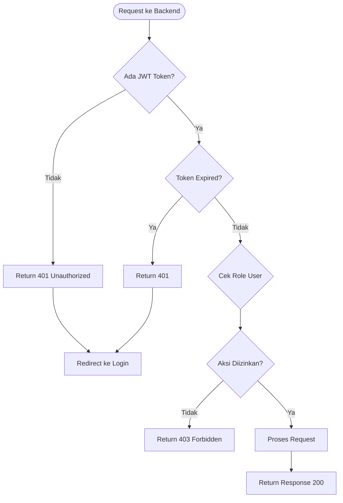
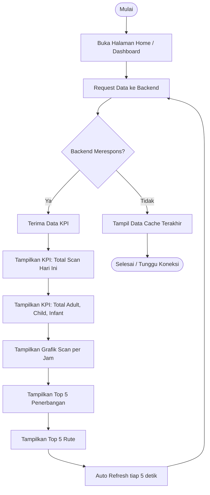
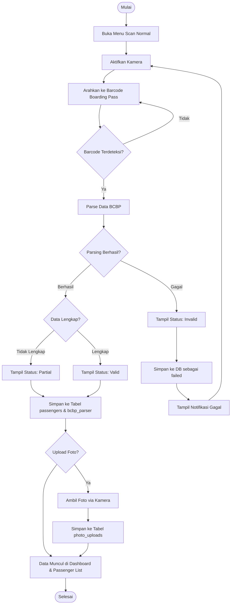
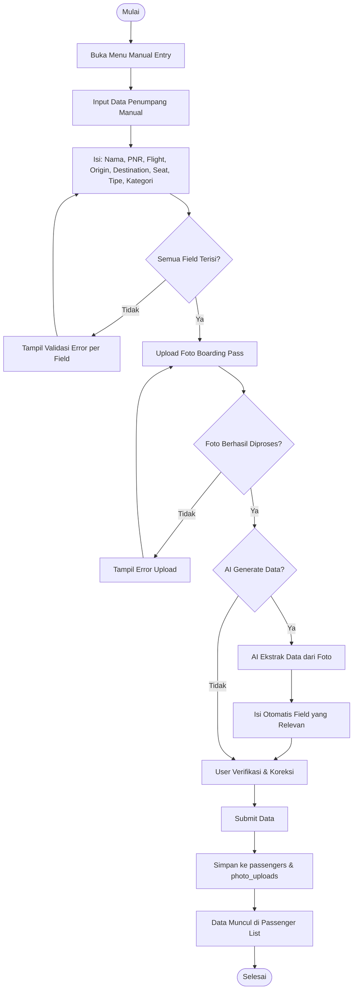

# 3.3.1.3 Pengembangan Aplikasi Mobile untuk Mendukung Operasional Kebandarudaraan

Dalam rangka mendukung transformasi digital operasional kebandarudaraan di PT Angkasa Pura Indonesia, penulis mendapat kepercayaan untuk merancang dan mengembangkan aplikasi mobile bernama **PIONA (Pionaku)** — sebuah sistem pemindaian tiket penumpang berbasis perangkat genggam yang dirancang khusus untuk kebutuhan petugas *boarding* di lingkungan bandar udara.

---

## 3.3.1.3.1 Analisis Kebutuhan dan Perancangan Aplikasi Mobile

### 3.3.1.3.1.1 Pemahaman Sistem PIONA

PIONA merupakan singkatan dari sistem internal yang digunakan untuk mencatat dan memantau proses *boarding* penumpang secara real-time. Sebelum adanya aplikasi ini, pencatatan penumpang dilakukan secara manual menggunakan formulir kertas atau spreadsheet, yang rentan terhadap kesalahan pencatatan dan lambat dalam pelaporan.

Sistem PIONA dirancang sebagai solusi digital end-to-end yang terdiri dari dua komponen utama:

| Komponen | Teknologi | Fungsi |
|---|---|---|
| **Backend API** | Node.js, Fastify, Prisma, PostgreSQL | Menyimpan, memproses, dan menyajikan data penumpang |
| **Mobile App** | Flutter (Dart) | Antarmuka petugas untuk scan, input data, dan monitoring |

Aplikasi mobile berperan sebagai ujung tombak pengumpulan data di lapangan. Petugas *boarding* menggunakan perangkat Android yang telah terpasang aplikasi PIONA untuk memindai *Boarding Card Barcode* (BCBP) setiap penumpang sebelum masuk ke pesawat.

**Alur data secara keseluruhan** adalah sebagai berikut:

```
Boarding Pass Penumpang
        │
        ▼
[Kamera Perangkat Android]
        │  Scan barcode / foto
        ▼
[Aplikasi PIONA Mobile]
        │  Parse BCBP
        │  Tampil status (valid/partial/failed)
        ▼
[Backend API – Node.js]
        │  Simpan ke PostgreSQL
        ▼
[Dashboard Web & Mobile]
        │  Monitoring real-time
        ▼
[Laporan & Rekap Harian]
```

---

### 3.3.1.3.1.2 Analisis Proses Bisnis Boarding

Proses *boarding* penumpang pesawat di PT Angkasa Pura Indonesia melibatkan beberapa tahapan yang harus dilakukan secara efisien untuk menjaga ketepatan waktu keberangkatan. Berikut adalah gambaran alur proses bisnis yang menjadi dasar perancangan aplikasi:

**Alur Kerja Petugas Boarding (Flowchart Keseluruhan):**



Dari analisis proses bisnis tersebut, dapat diidentifikasi tiga skenario utama dalam operasional *boarding*:

1. **Skenario Normal** – Barcode terbaca sempurna, semua data penumpang berhasil di-*parse* dan langsung tersimpan ke sistem.
2. **Skenario Partial** – Barcode terbaca sebagian, data yang tersedia disimpan namun petugas perlu melengkapi data yang kurang secara manual.
3. **Skenario Manual Entry** – Barcode tidak dapat dibaca (rusak, basah, atau tidak tercetak jelas), petugas melakukan input data penumpang secara manual disertai foto boarding pass sebagai bukti.

**Proses Parsing BCBP (*Boarding Card Barcode Parser*):**

Format BCBP mengikuti standar IATA yang mengandung informasi: nama penumpang, nomor PNR, kode penerbangan, nomor kursi, bandara asal, bandara tujuan, dan tanggal keberangkatan. Berikut alur parsing yang diimplementasikan:



---

### 3.3.1.3.1.3 Observasi Sistem Eksisting

Sebelum memulai pengembangan, dilakukan observasi terhadap sistem yang telah ada di lingkungan PT Angkasa Pura Indonesia. Dari hasil observasi, ditemukan beberapa kondisi yang menjadi latar belakang pengembangan aplikasi mobile ini:

| Kondisi Eksisting | Permasalahan | Solusi dalam PIONA |
|---|---|---|
| Pencatatan manual menggunakan kertas | Rentan kehilangan data, tidak real-time | Scan otomatis langsung tersimpan ke database |
| Rekap dilakukan setelah *shift* selesai | Data tidak tersedia real-time untuk manajemen | Dashboard dengan auto-refresh setiap 5 detik |
| Tidak ada standarisasi format data penumpang | Data tidak konsisten antar gate/terminal | Format data terstandar mengikuti IATA BCBP |
| Pelaporan memerlukan waktu 1–2 hari | Lambat dalam pengambilan keputusan | Laporan dapat diakses kapan saja dari aplikasi |
| Tidak ada sistem monitoring per *scan point* | Sulit memantau produktivitas petugas | Dashboard per scan point dengan KPI real-time |

---

### 3.3.1.3.1.4 Identifikasi Kebutuhan Fitur

Berdasarkan analisis proses bisnis dan observasi sistem eksisting, dilakukan identifikasi kebutuhan fitur melalui pendekatan *use case analysis*. Berikut diagram use case yang merepresentasikan seluruh kebutuhan fungsional sistem:



**Ringkasan Kebutuhan Fungsional:**

| Kode | Use Case | Deskripsi | Aktor |
|---|---|---|---|
| UC-01 | Login | Autentikasi petugas dengan username, password, scan point, dan bandara | Semua |
| UC-02 | Logout | Keluar dari sesi aktif dan menghapus token JWT | Semua |
| UC-03 | Scan Normal | Memindai BCBP penumpang penerbangan langsung | Petugas Scan |
| UC-04 | Scan Transit | Memindai BCBP penumpang transit/sambungan | Petugas Scan |
| UC-05 | Manual Entry | Input data penumpang secara manual + foto | Petugas Scan |
| UC-06 | Dashboard KPI | Melihat statistik scan real-time (total, grafik, top flight) | Semua |
| UC-07 | Daftar Penumpang | Melihat seluruh data penumpang yang telah tercatat | Semua |
| UC-08 | Filter & Cari | Memfilter data berdasarkan nama, flight, status, dll. | Semua |
| UC-09 | Upload Foto | Mengunggah foto boarding pass sebagai dokumentasi | Petugas Scan |
| UC-10 | Kelola User | CRUD data pengguna aplikasi | Admin, IT |
| UC-11 | Kelola Scan Point | CRUD titik scan/gate di bandara | Admin, IT |
| UC-12 | Laporan Rekap | Melihat dan mengekspor rekap data harian | Admin, IT, Viewer |
| UC-13 | Auto Refresh | Pembaruan data otomatis tanpa interaksi pengguna | Sistem |

---

### 3.3.1.3.1.5 Studi Perbandingan: React Native vs Flutter

Dalam tahap perencanaan, dilakukan studi komparatif antara dua *framework* pengembangan aplikasi mobile lintas platform yang paling banyak digunakan saat ini, yaitu **React Native** dan **Flutter**. Tujuannya adalah memilih teknologi yang paling sesuai dengan kebutuhan aplikasi PIONA.

| Kriteria Evaluasi | React Native | Flutter |
|---|---|---|
| **Bahasa Pemrograman** | JavaScript / TypeScript | Dart |
| **Performa Rendering** | Bridge JS–Native (overhead) | Compiled to native ARM, rendering langsung via Skia/Impeller |
| **Konsistensi UI Antar Platform** | Bergantung komponen native masing-masing OS | Identik di semua platform (custom rendering engine) |
| **Ekosistem Library** | Sangat besar (NPM) | Berkembang pesat (pub.dev) |
| **Dukungan Kamera & Barcode** | Baik (react-native-camera, vision-camera) | Sangat baik (mobile_scanner, camera) |
| **Hot Reload** | Ya | Ya (lebih cepat) |
| **Ukuran Binary** | Lebih kecil | Sedikit lebih besar (~5–10 MB) |
| **Kurva Belajar** | Mudah bagi pengguna JavaScript | Sedang (bahasa baru, namun sintaks bersih) |
| **Dukungan Google** | Tidak langsung (Meta) | Resmi didukung Google |
| **Stabilitas untuk Aplikasi Enterprise** | Baik | Sangat baik |

**Keputusan: Flutter dipilih** dengan pertimbangan utama sebagai berikut:

1. **Performa kamera lebih baik** – Fitur scan barcode adalah inti aplikasi PIONA. Flutter dengan library `mobile_scanner` memberikan performa deteksi barcode yang lebih responsif dan stabil dibanding ekuivalen React Native, terutama pada perangkat Android kelas menengah yang umum digunakan di lingkungan bandara.

2. **Konsistensi UI** – Flutter merender UI-nya sendiri menggunakan *Skia engine*, sehingga tampilan aplikasi identik di semua perangkat Android tanpa bergantung pada komponen native yang berbeda-beda antar versi OS.

3. **Tipe data yang ketat (Dart)** – Bahasa Dart bersifat *strongly typed*, yang mengurangi risiko bug runtime pada logika parsing data BCBP yang kompleks. Dibanding JavaScript yang bersifat *dynamically typed*, Dart lebih aman untuk pengembangan aplikasi enterprise.

4. **Dukungan jangka panjang** – Flutter adalah proyek resmi Google dengan dukungan komunitas dan pembaruan yang aktif, menjamin keberlanjutan aplikasi ke depannya.

---

### 3.3.1.3.1.6 Perancangan UI Mobile

Perancangan antarmuka pengguna (UI) dilakukan dengan mempertimbangkan kemudahan penggunaan di lingkungan yang sibuk (bandara), dengan keterbacaan tinggi, tombol berukuran cukup untuk disentuh dengan cepat, dan respons visual yang jelas.

**Prinsip desain yang diterapkan:**
- **Kontras tinggi** – Teks dan elemen interaktif menggunakan warna dengan kontras tinggi agar mudah dibaca di berbagai kondisi pencahayaan.
- **Floating Navigation Bar** – Navigasi berbentuk pil mengambang (*floating pill navbar*) dengan tombol scan di tengah sebagai *Floating Action Button* (FAB) memberikan akses cepat ke fitur utama.
- **Dark Mode & Light Mode** – Aplikasi mendukung dua tema untuk kenyamanan penggunaan dalam berbagai situasi.
- **Feedback Visual Instan** – Setiap hasil scan menampilkan *modal* dengan warna hijau (berhasil), kuning (partial), atau merah (gagal) secara langsung.

**Struktur Navigasi Aplikasi:**

```
LoginScreen
    │
    └── [Berhasil Login]
            │
    ┌───────┴────────────────────────────────┐
    │          PionaShellScaffold            │
    │  ┌──────────────────────────────────┐  │
    │  │     PionaFloatingNavBar          │  │
    │  │  Home | Transit | [Scan] | List  │  │
    │  │               | Manual Entry     │  │
    │  └──────────────────────────────────┘  │
    │                                        │
    │  ┌──────────┐  ┌──────────┐           │
    │  │HomeScreen│  │ScanScreen│  ...       │
    │  └──────────┘  └──────────┘           │
    └────────────────────────────────────────┘
```

---

## 3.3.1.3.2 Pengembangan Frontend Aplikasi Mobile Menggunakan Flutter

### 3.3.1.3.2.1 Setup Environment Flutter

Pengembangan aplikasi mobile PIONA menggunakan Flutter versi **3.x (stable channel)**. Berikut adalah langkah-langkah persiapan lingkungan pengembangan yang dilakukan:

**Spesifikasi Lingkungan Pengembangan:**

| Komponen | Versi / Detail |
|---|---|
| Flutter SDK | 3.44.1 (stable) |
| Dart SDK | Bundled dengan Flutter |
| IDE | Visual Studio Code + Flutter Extension |
| Android SDK | API Level 33 (Android 13) |
| Target Device | Android (Physical Device & Emulator) |
| Build System | Gradle (Android) |
| Dependency Manager | `pub` (Flutter Package Manager) |

**Dependensi Utama yang Digunakan (`pubspec.yaml`):**

| Package | Versi | Fungsi |
|---|---|---|
| `mobile_scanner` | ^6.x | Pemindai barcode menggunakan kamera |
| `http` | ^1.x | HTTP client untuk komunikasi dengan backend API |
| `flutter_secure_storage` | ^9.x | Penyimpanan aman untuk session data (JWT, scan point) |
| `sentry_flutter` | ^8.x | Error monitoring dan crash reporting |
| `flutter_localizations` | bundled | Dukungan internasionalisasi (Bahasa Indonesia) |
| `provider` | ^6.x | State management berbasis ChangeNotifier |

**Konfigurasi API Backend:**

Koneksi ke backend dikonfigurasi melalui *compile-time environment variable* menggunakan `String.fromEnvironment`, sehingga URL backend dapat diubah saat build tanpa mengubah kode sumber:

```dart
// lib/services/api_config.dart
class ApiConfig {
  ApiConfig._();

  static const String baseUrl = String.fromEnvironment(
    'PIONA_API_BASE_URL',
    defaultValue: 'http://192.168.1.103:8080',
  );
}
```

Pendekatan ini memungkinkan satu codebase dijalankan di berbagai lingkungan (development, staging, production) hanya dengan mengubah parameter saat proses build.

---

### 3.3.1.3.2.2 Struktur Project

Struktur direktori project Flutter PIONA dirancang mengikuti prinsip **separation of concerns**, di mana setiap lapisan tanggung jawab dipisahkan ke dalam folder yang berbeda:

```
pionaku/lib/
├── main.dart                    ← Entry point aplikasi
├── app_theme_scope.dart         ← Provider scope untuk tema global
│
├── screens/                     ← Halaman-halaman utama aplikasi
│   ├── login_screen.dart        ← Halaman login
│   ├── home_screen.dart         ← Dashboard & KPI
│   ├── home_widgets.part.dart   ← Widget pendukung home screen
│   ├── home_models.dart         ← Model data untuk home
│   ├── home_design_tokens.dart  ← Konstanta desain khusus home
│   ├── scan_screen.dart         ← Halaman scan barcode
│   ├── manual_entry_screen.dart ← Halaman input data manual
│   ├── passenger_list_screen.dart ← Daftar penumpang
│   ├── passenger_reports_screen.dart ← Laporan & rekap
│   ├── management_screen.dart   ← Manajemen user & scan point
│   └── profile_screen.dart      ← Profil & pengaturan akun
│
├── services/                    ← Layer komunikasi data & state
│   ├── api_config.dart          ← Konfigurasi base URL backend
│   ├── piona_http_client.dart   ← HTTP client wrapper (timeout, header)
│   ├── auth_api.dart            ← API endpoint autentikasi
│   ├── passenger_scans_api.dart ← API endpoint data penumpang
│   ├── manual_entry_api.dart    ← API endpoint manual entry
│   ├── scan_points_api.dart     ← API endpoint scan point
│   ├── users_api.dart           ← API endpoint manajemen user
│   ├── session_api.dart         ← API endpoint session/heartbeat
│   ├── session_context_store.dart ← State: sesi login & JWT
│   ├── passenger_scan_store.dart  ← State: daftar scan penumpang
│   ├── manual_entry_capture_store.dart ← State: proses manual entry
│   ├── scan_point_store.dart    ← State: daftar scan point
│   ├── user_store.dart          ← State: manajemen user
│   ├── reports_dataset.dart     ← Model data laporan
│   ├── reports_exporter.dart    ← Logika ekspor laporan
│   └── api_errors.dart          ← Definisi error/exception API
│
├── widgets/                     ← Komponen UI yang dapat digunakan ulang
│   ├── piona_bottom_nav.dart    ← Floating navigation bar
│   ├── piona_shell_scaffold.dart ← Layout shell utama aplikasi
│   ├── piona_date_picker.dart   ← Komponen date picker kustom
│   └── result_modal.dart        ← Modal hasil scan
│
├── theme/                       ← Sistem desain & tema visual
│   └── app_theme.dart           ← Definisi tema terang & gelap
│
├── constants/                   ← Konstanta aplikasi
└── utils/                       ← Fungsi utilitas umum
```

Pola arsitektur yang digunakan adalah **Service Layer + Store Pattern**, di mana:
- **`*_api.dart`** – Bertanggung jawab atas komunikasi HTTP dengan backend (stateless).
- **`*_store.dart`** – Menyimpan state aplikasi menggunakan `ChangeNotifier` (stateful).
- **`screens/`** – Hanya menangani tampilan, membaca dari store, dan memanggil service.

---

### 3.3.1.3.2.3 Implementasi Login Page

Halaman login adalah pintu masuk utama aplikasi PIONA. Selain memvalidasi kredensial pengguna, halaman ini juga mengharuskan petugas memilih **bandara** dan **scan point** (gate/terminal) tempat mereka bertugas hari itu. Informasi ini akan digunakan oleh sistem untuk menandai setiap data scan dengan lokasi yang tepat.

**Activity Diagram – Proses Login:**



**Implementasi Autentikasi (`auth_api.dart`):**

Proses login dilakukan dengan mengirimkan HTTP POST ke endpoint `/auth/login` beserta kredensial pengguna dan informasi lokasi:

```dart
// Mengirim request login ke backend
Future<LoginResponse> login({
  required String username,
  required String password,
  required String airportCode,
  required String checkpoint,
}) async {
  final uri = _http.url('/auth/login');
  final res = await _http.post(
    uri,
    body: jsonEncode({
      'username': username,
      'password': password,
      'airportCode': airportCode,
      'checkpoint': checkpoint,
    }),
    bearerToken: null,
  );
  // Validasi response & ekstrak JWT token
  final decoded = jsonDecode(res.body);
  final token = decoded['token'];   // JWT untuk request berikutnya
  final user  = decoded['user'];    // Data user (id, username, role)
  return LoginResponse(token: token, ...);
}
```

**Manajemen Session (`session_context_store.dart`):**

Setelah login berhasil, data sesi disimpan menggunakan dua mekanisme:
- **In-memory** – JWT token disimpan di memori (tidak di-persist ke disk untuk keamanan)
- **Secure Storage** – Data non-sensitif seperti scan point, airport, dan role disimpan menggunakan `FlutterSecureStorage` agar tetap tersedia saat aplikasi di-restart

```dart
// Dipanggil setelah login berhasil
void setFromLogin({
  required String airportOptionLine,
  required String checkpoint,
  String? jwtToken,
  String? role,
}) {
  _jwtToken = jwtToken;       // In-memory only (tidak di-persist)
  _scanPoint = checkpoint;
  _role = role ?? 'Scan';
  notifyListeners();
  unawaited(persistToSecureStorage()); // Simpan data non-sensitif
}
```

**Mekanisme Session Management & JWT Flow:**



---

### 3.3.1.3.2.4 Implementasi Home Page (Dashboard KPI)

Halaman utama (*Home Screen*) menampilkan dashboard real-time yang memberikan gambaran menyeluruh kepada petugas dan manajemen tentang kondisi *boarding* hari ini. Data diperbarui secara otomatis tanpa perlu interaksi pengguna.

**Activity Diagram – Melihat Dashboard:**



**Komponen-komponen Home Screen:**

| Komponen | Deskripsi |
|---|---|
| **KPI Summary Cards** | Menampilkan total penumpang (Adult, Child, Infant), total scan hari ini, dan jumlah penerbangan unik |
| **Grafik Scan per Jam** | Bar chart interaktif menampilkan distribusi scan dari jam pertama hingga terakhir |
| **Top 5 Penerbangan** | Ranking penerbangan dengan jumlah penumpang terbanyak hari ini |
| **Top 5 Rute** | Ranking rute (Origin → Destination) dengan traffic terbanyak |
| **Filter Scope** | Toggle untuk melihat data bandara aktif saja atau seluruh bandara (all airports) |
| **Auto-refresh Indicator** | Indikator visual yang menunjukkan kapan data terakhir diperbarui |

Data pada Home Screen disinkronkan setiap **5 detik** menggunakan `Timer.periodic`, dan saat aplikasi kembali ke foreground menggunakan `WidgetsBindingObserver`. Pendekatan ini memastikan data yang ditampilkan selalu segar tanpa membebani backend dengan request yang terlalu sering.

---

### 3.3.1.3.2.5 Implementasi Scan BCBP

Halaman scan adalah fitur inti aplikasi PIONA. Terdapat dua mode scan yang dapat diakses melalui navigasi utama:

- **Scan Normal** – Untuk penumpang penerbangan langsung (direct flight)
- **Scan Transit** – Untuk penumpang yang melakukan perjalanan dengan transit/sambungan

**Activity Diagram – Proses Scan Boarding Pass:**



**Implementasi Teknis Scan Screen:**

Library `mobile_scanner` digunakan untuk mengakses kamera dan mendeteksi barcode secara real-time. Barcode yang terdeteksi langsung diproses menggunakan parser BCBP yang mengimplementasikan standar IATA:

```dart
// Scan screen menggunakan MobileScanner widget
MobileScanner(
  onDetect: (capture) {
    final barcode = capture.barcodes.firstOrNull;
    if (barcode?.rawValue != null) {
      _processBarcode(barcode!.rawValue!);
    }
  },
)

// Parsing BCBP dan menyimpan ke store
void _processBarcode(String rawValue) {
  final result = BcbpParser.parse(rawValue);
  // Tambah ke PassengerScanStore (optimistic update + POST ke backend)
  PassengerScanStore.instance.addFromScan(
    result: result,
    mode: widget.scanMode,
    scanPointFallback: session.scanPoint,
  );
  // Tampilkan modal hasil
  _showResultModal(result);
}
```

**Mekanisme Optimistic Update & Retry Queue:**

Salah satu fitur penting aplikasi PIONA adalah kemampuannya bekerja dalam kondisi koneksi internet yang tidak stabil (yang umum terjadi di lingkungan bandara). Sistem menggunakan pola *optimistic update* dengan *retry queue*:

1. **Optimistic Update** – Data langsung ditampilkan di UI tanpa menunggu konfirmasi dari server.
2. **Async POST** – Data dikirim ke backend secara asinkron di background.
3. **Retry dengan Exponential Backoff** – Jika POST gagal, sistem otomatis mencoba ulang dengan jeda yang semakin panjang (2s → 4s → 8s → 16s → 32s → 60s).
4. **Deduplication** – Backend mendeteksi data duplikat (barcode + scanPoint + tanggal yang sama) dan menolaknya dengan respons khusus, sehingga data tidak tercatat ganda.

---

### 3.3.1.3.2.6 Implementasi Manual Entry

Fitur *Manual Entry* dirancang untuk situasi di mana barcode boarding pass tidak dapat dipindai. Petugas dapat memasukkan data penumpang secara manual melalui form yang terstruktur, dilengkapi dengan kemampuan upload foto boarding pass sebagai dokumentasi.

**Activity Diagram – Proses Manual Entry:**



Fitur unggulan dari halaman Manual Entry adalah kemampuan **AI-assisted data extraction**: saat petugas mengambil foto boarding pass, sistem dapat mencoba mengekstrak data dari gambar tersebut secara otomatis menggunakan layanan AI, sehingga mengurangi beban input manual secara signifikan.

---

### 3.3.1.3.2.7 Implementasi Navigation System

Sistem navigasi PIONA menggunakan **Floating Navigation Bar** kustom yang dibangun dari awal menggunakan Flutter, tanpa bergantung pada widget `BottomNavigationBar` bawaan Material Design. Keputusan ini diambil untuk mendapatkan fleksibilitas desain penuh dan tampilan yang lebih modern.

**Komponen Navigasi (`PionaFloatingNavBar`):**

```dart
enum PionaNavItem {
  home,         // Dashboard & KPI
  scanTransit,  // Scan untuk penumpang transit
  scanNormal,   // Scan normal (FAB di tengah)
  passengerList, // Daftar penumpang
  manualEntry,  // Input data manual
}
```

Navigasi terdiri dari **4 item di sidebar** dan **1 Floating Action Button (FAB)** di tengah untuk fitur Scan Normal — yang merupakan fungsi yang paling sering digunakan oleh petugas. Desain ini mengikuti prinsip *thumb-friendly design* agar mudah dijangkau dengan ibu jari saat memegang perangkat dengan satu tangan.

**Fitur teknis floating navbar:**
- **Animasi transisi** – Item aktif menampilkan efek *pill* dengan animasi 180ms untuk feedback visual yang responsif.
- **Adaptive padding** – Navbar secara otomatis menyesuaikan jarak dengan system navigation bar menggunakan `MediaQuery.viewPaddingOf(context)` untuk kompatibilitas dengan berbagai ukuran layar dan sistem gestural Android.
- **Dark/Light mode** – Warna navbar menyesuaikan tema aktif.

---

### 3.3.1.3.2.8 Implementasi State Management

Aplikasi PIONA menggunakan pola **ChangeNotifier + Service Locator** untuk manajemen state. Setiap domain data dikelola oleh sebuah *Store* yang merupakan subclass dari `ChangeNotifier`, dan diakses sebagai singleton di seluruh aplikasi.

**Arsitektur State Management:**

```
┌─────────────────────────────────────────────────┐
│                  UI Layer (Screens)              │
│  ListenableBuilder / AnimatedBuilder /           │
│  setState                                        │
└───────────────────────┬─────────────────────────┘
                        │ reads & calls methods
┌───────────────────────▼─────────────────────────┐
│                  Store Layer                     │
│  SessionContextStore   ← Sesi, JWT, role, airport│
│  PassengerScanStore    ← Data scan penumpang     │
│  ManualEntryCaptureStore ← Proses manual entry   │
│  ScanPointStore        ← Daftar scan point       │
│  UserStore             ← Manajemen pengguna      │
└───────────────────────┬─────────────────────────┘
                        │ calls API methods
┌───────────────────────▼─────────────────────────┐
│                 Service Layer (API)              │
│  AuthApi, PassengerScansApi, ManualEntryApi,     │
│  ScanPointsApi, UsersApi, SessionApi             │
└───────────────────────┬─────────────────────────┘
                        │ HTTP requests
┌───────────────────────▼─────────────────────────┐
│              Backend API (Node.js)               │
│  REST API @ http://[server]:8080                 │
└─────────────────────────────────────────────────┘
```

**Contoh alur data scan:**

```
1. Petugas scan barcode di ScanScreen
        │
2. ScanScreen memanggil PassengerScanStore.addFromScan()
        │
3. Store (optimistic update):
   - Tambah record ke _records list
   - notifyListeners() → UI update instan
   - Tambah ke _pendingPosts queue
        │
4. _drainPostQueue() (async, background):
   - POST ke /passenger-scans via PassengerScansApi
   - Jika berhasil → hapus dari pending queue
   - Jika gagal → armRetryTimer() dengan exponential backoff
        │
5. HomeScreen & PassengerListScreen otomatis update
   karena mereka listen ke PassengerScanStore
```

**Keunggulan pola ini dibanding setState biasa:**
- State tersentralisasi, tidak tersebar di berbagai widget
- Data tetap konsisten meski berpindah halaman
- Retry logic dan error handling terpusat di Store
- Mudah di-test secara unit

---

## Ringkasan Teknis Pengembangan

Secara keseluruhan, pengembangan aplikasi mobile PIONA menghasilkan sebuah sistem yang:

| Aspek | Implementasi |
|---|---|
| **Arsitektur** | Service Layer + Store Pattern (ChangeNotifier) |
| **State Management** | ChangeNotifier + ListenableBuilder (tanpa package tambahan) |
| **Komunikasi Data** | REST API dengan HTTP, JWT Bearer Token |
| **Penyimpanan Lokal** | FlutterSecureStorage untuk data sensitif sesi |
| **Ketahanan Jaringan** | Optimistic update + Retry queue dengan exponential backoff |
| **Kamera & Scan** | mobile_scanner (MLKit-based, mendukung QR & barcode 1D/2D) |
| **Monitoring Error** | Sentry Flutter untuk crash reporting di production |
| **Lokalisasi** | Bahasa Indonesia sebagai default, mendukung Bahasa Inggris |
| **Tema** | Light Mode & Dark Mode dengan sistem desain konsisten |
